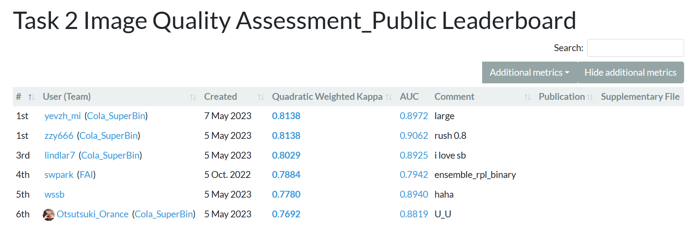

# DRAC22
This repo covers Cola_SuperBin group's solution to the second task(image quality assessment) of DRAC 2022 Diabetic Retinopathy Analysis Challenge(DRAC).

## Dataset

We download the dataset from [DRAC 2022](https://drac22.grand-challenge.org/Description/).

The dataset contains a training set consisting of 665 images and test set consisting of 438 images.

## Usage

1. Clone our repository:

   ```shell
   git clone https://github.com/Otsuts/DRAC22.git
   cd DRAC22
   ```

2. To run our code, you can use the command:

   ```shell
   python main.py --model <model_name> --batch_size <batch_size> --num_epochs <training epochs> --lr <learning rate> --weight_decay <weight decay> --save_model <save model> --device <which device> --transform <augmentation> --k_fold <ensemble>
   ```

## Final Ranking

Our team Colar_Super_Bin **ranks 1st** on the leaderboard!




